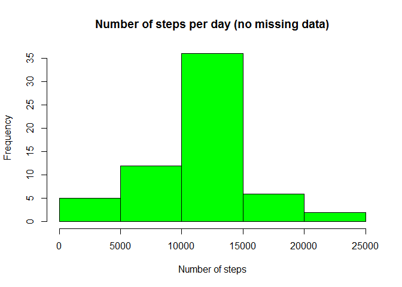

# Reproducible Research: Peer Assessment 1

First of all, required packages for the analysis are loaded:


```r
# Load packages
library(dplyr, warn.conflicts = FALSE)
library(ggplot2, warn.conflicts = FALSE)
```

## Loading and preprocessing the data

The dataset is available for download in the following link: [Activity monitoring data](https://d396qusza40orc.cloudfront.net/repdata%2Fdata%2Factivity.zip)

The file is also available in the current repository, so we proceed to unzip and read it.


```r
# Unzip file
unzip("activity.zip")

# Read dataset
data <- read.csv("activity.csv",
         na.strings = "NA",
         colClasses = c("integer", "Date", "integer"))
```


## What is mean total number of steps taken per day?

In order to calculate the number of steps per day, the data is grouped by date and summarized using the `sum` function.


```r
# Obtain steps per day
dataPerDay <- data %>%
  group_by(date) %>%
  summarise(steps = sum(steps, na.rm = TRUE))
```

The following is a histogram of the total number of steps taken each day.


```r
# Plot histogram of the total number of steps taken each day
hist(dataPerDay$steps,
     col = "green",
     main = "Number of steps per day",
     xlab = "Number of steps")
```


The mean and median number of steps taken each day are calculated with:


```r
# Calculate the mean and median of the total number of steps taken per day
stepsDayMean <- mean(dataPerDay$steps)
stepsDayMedian <- median(dataPerDay$steps)
```

- **Mean**: 9354.2295082  
- **Median**: 10395

## What is the average daily activity pattern?

In order to calculate the number of steps per interval, the data is grouped by interval and summarized using the `mean` function.


```r
# Obtain average steps per interval
dataPerInterval <- data %>%
  group_by(interval) %>%
  summarise(steps = mean(steps, na.rm = TRUE))
```

The following is a time series plot of the average number of steps per 5-minute interval.


```r
# Plot time series
with(dataPerInterval,
     plot(interval, steps,
          col = "blue",
          type = "l",
          main = "Average steps per interval of the day",
          xlab = "5-minute interval",
          ylab = "Number of steps"
     )
)
```


As expected, between midnight and 5:00 AM there is minimum activity. The most active period in the day is between 7:30 AM and 10:00 AM. The rest of the day, the activity level goes up and down until 8:00 PM when it starts decreasing consistently.

The `max` function is used to find the more active 5-minute interval, i.e., the 5-minute interval that, on average, contains the maximum number of steps.


```r
# Get intervals with the maximum average of steps per day
intervalMaxSteps <- dataPerInterval %>%
  filter(steps == max(dataPerInterval$steps)) %>%
  select(interval)
```

**More active interval**: 835 

## Imputing missing values

The `complete.cases()` function is used to calculate the number of missing values.


```r
# Calculate total number of missing values
NAnum <- sum(!complete.cases(data))
```

**Missing values**: 2304

The strategy to fill in the missing values consists in taking the mean of steps for each 5-minute interval of the day and assign it to the observations for the same interval with missing data. Since the number of steps is always an integer number, the value is rounded.


```r
# Create a copy of the original dataset
fData <- data

# Use 5-minute interval mean to fill NAs
for (i in which(!complete.cases(fData$steps))) {
  currentInterval <- fData[i, "interval"]
  fData$steps[i] <- as.integer(round(dataPerInterval[dataPerInterval$interval == currentInterval, "steps"]))
}
```

Now that we have no missing values, we calculate once more the number of steps per day and plot a histogram for that.


```r
# Obtain steps per day with the missing data filled in
fDataPerDay <- fData %>%
  group_by(date) %>%
  summarise(steps = sum(steps)) %>%
  arrange(date)

# Plot histogram of the total number of steps taken each day with filled data
hist(fDataPerDay$steps,
     col = "green",
     main = "Number of steps per day (no missing data)",
     xlab = "Number of steps")
```



The mean and median numbers are:


```r
# Calculate the mean and median of the total number of steps taken per day for
# filled data
fStepsDayMean <- mean(fDataPerDay$steps)
fStepsDayMedian <- median(fDataPerDay$steps)
```

- **Mean**: 1.0765639\times 10^{4}  
- **Median**: 10762

We can see that the mean and the median are much closer now.

## Are there differences in activity patterns between weekdays and weekends?

In order to analyze the activity patterns between weekdays and weekends, we create a new factor variable called `day_type` indicating whether the date of the observation is a weekday or weekend day.


```r
Sys.setlocale("LC_TIME", "English")
```

```
## [1] "English_United States.1252"
```

```r
# Create vectors with day names
weekday_days <- c("Monday", "Tuesday", "Wednesday", "Thursday", "Friday")
weekend_days <- c("Saturday", "Sunday")

# Add factor variable day_type, indicating if it's weekday or weekend
fData <- fData %>%
  mutate(day_type = as.factor(ifelse(weekdays(date) %in% weekday_days, "weekday", "weekend")))
```

The following is a panel plot comparing the average number of steps taken per 5-minute interval across weekdays and weekends.


```r
# Obtain average steps per interval per day type
fDataPerInterval <- fData %>%
  group_by(interval, day_type) %>%
  summarise(steps = mean(steps))

# Plot a time series for the average number of steps per interval and day type
qplot(interval, steps,
      data = fDataPerInterval,
      facets = day_type ~ .,
      geom = "path",
      main = "Average number of steps per interval and day type",
      xlab = "Interval",
      ylab = "Number of steps")
```


From the plot we can observe that during weekdays there is a peak between 7:30 AM and 10:00 AM. In weekend days the distribution of the activity is more uniform than in weekdays.
